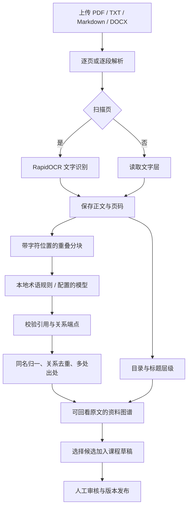

# 从书籍生成图谱：依据与实现

当前实现采用“解析资料—分块抽取—合并出处—资料图谱—课程审核”的流水线。方法依据集中在三条主线：**Docling 的文档解析分层、Microsoft GraphRAG 的有出处图索引、EDC 的抽取与规范化分离**。论文和大型项目支持技术路线的合理性；本项目的中文教材效果由自己的测试与人工抽查说明。

## 阶段与代码对照

| 阶段 | 学术或开源依据 | 本项目代码 | 实现与边界 |
| --- | --- | --- | --- |
| PDF 解析与 OCR | [Docling 技术报告 v5，§3.1–3.3][docling-paper]：PDF 后端、页面模型、文档组装分层 | [documents.py](../src/learning_agent/documents.py)：`parse_page`、`ocr_page`、`text_pages` | 已实现 PyMuPDF 文字层读取与 RapidOCR 扫描识别。未接入 Docling，未实现其版式模型、TableFormer 表格结构恢复或公式理解。 |
| 长文分块 | [GraphRAG 官方数据流 Phase 1–2][gr-dataflow]：TextUnit 与来源文档互相关联 | `chunks`、`DocumentStore.run` | 已实现按页分块，默认 3200 字符、240 字符重叠；保存页码与字符位置。这里是字符预算，不是上游的 token 预算。 |
| 概念与关系抽取 | [GraphRAG 的 `extract_graph`][gr-extract]；[EDC，§3.1][edc-paper] | `extract_local`、`extract_llm` | 本地模式为术语、严格句式包含关系和共现。模型模式使用配置的聊天模型，输出结构、逐字引文与端点接受校验；未训练 REBEL，也未复现 EDC 的开放抽取完整框架。 |
| 合并与规范化 | [GraphRAG 的合并函数][gr-extract]保留来源块标识；[EDC 规范化实现][edc-code]以候选检索和模型验证判断语义等价 | `normalized`、`term_id`、`DocumentStore.assemble` | 已实现文字形式归一、同名合并、类型与端点去重及多处证据。没有 EDC 的语义检索器和验证阶段；同名异义与别名合并仍需审核。 |
| 原文回溯 | [GraphRAG 数据模型][gr-entity]中的 `text_unit_ids` 支持来源追踪 | `proof`、`extract_llm`、`DocumentStore.page`；[document_api.py](../src/learning_agent/document_api.py) 的原文件与页面接口 | 已保存 `page/start/end/quote`，合并后每项最多保留 20 处证据。模型引用须逐字定位；OCR 引用对应识别正文，可打开原 PDF 页核对。字符串相符与语义支持分别验证。 |
| 层级与呈现 | 教材目录、v7 课程层级和用户参考；属于本项目交互设计 | `document_outline`、`hierarchy`；[graph-encoding.js](../static/graph-encoding.js)、[network-view.js](../static/network-view.js) | 已使用目录或标题组织章节，无有效目录时按页分组。层级独立于概念语义边；未使用 GraphRAG 的 Leiden 社区作为教材章节。 |
| 中断续作 | 持久化中间产物与幂等任务处理；Molio 的处理清单是工程对照 | `atomic_json`、`DocumentStore.run/submit/cancel/status` | 已落盘页面与分块结果，重试沿用已有结果；任务状态与部分失败保留。此能力不是 LightRAG 的跨文档增量知识索引。 |
| 加入课程 | v7 §3.2 人工核验、版本留存 | `DocumentStore.import_draft`、`CourseGraphStore.save_graph/publish` | 选定节点与关系加入草稿并校验版本。共现进入草稿时映射为 `related`，同时保留 `extraction_type=cooccurs` 与原文；审核前仍是候选。正式学习顺序由审核后的先修关系约束。 |

资料图谱展示上限为 500 个概念、2000 条关系，完整分块候选保存在任务目录。结构规模限制、引用校验通过和图谱渲染成功都不能替代内容质量评估。[真实教材抽查与复现命令](document-graph-method.md#2026-10-08-本机抽查)分别记录了解析、术语、关系和出处结果。

## 可核对的上游版本

以下源码在 2026-10-08 查阅，链接固定到提交，避免把随时变化的 README 当成实现证据。

| 项目 | 固定版本与查阅位置 | 本次用途 |
| --- | --- | --- |
| Microsoft GraphRAG | [`769542fb` 的抽取与合并代码][gr-extract]、[`Entity` 模型][gr-entity]、[数据流文档源码][gr-dataflow] | 分块、抽取、合并、出处追踪的主工程参照。 |
| EDC | [`02aad17e` 的 `SchemaCanonicalizer`][edc-code]；[EMNLP 2024 论文][edc-paper] | 区分字形归一与需要语义验证的规范化。 |
| Docling | [`1c08724e` 的 PDF 管线][docling-code]；[技术报告 2408.09869v5][docling-paper] | 文档解析阶段设计及未来版式、表格增强的参照。当前依赖仍为 PyMuPDF 与 RapidOCR。 |

补充核对了 [LightRAG，Findings of EMNLP 2025，§3.1–3.2](https://aclanthology.org/2025.findings-emnlp.568.pdf)及其 [`453dce83` 的 `operate.py`](https://github.com/HKUDS/LightRAG/blob/453dce83d6d0354a06e46c8d4029a0895c4e054b/lightrag/operate.py)：其图索引同样涉及分块、实体关系抽取、去重和来源块；双层检索、向量表示与增量知识更新属于进一步的问答检索系统。当前项目未接入 LightRAG，也未实现该论文的双层检索，因此没有把它列为现成功能。

## 当前视觉约定

节点大小按层级：课程/书籍根为 42，章为 32，更深层级依次为 26、22、19、17、15，概念为 12（画布单位，随整体缩放）。连接数和出现频率不改变节点大小。同一家族使用同色系，见[配色规则](document-graph-method.md#配色规则)。

图谱完成初始布局后保持静止。单击节点打开详情；结构节点右键菜单提供展开、收起，并显示本次受影响的节点数。折叠沿目录子树传播，跨章节共享且仍有展开归属的概念保留，概念叶节点无折叠操作。筛选和折叠保持既有节点坐标与视口，主动“整理”才重新排布。这些是用户提出的阅读与导航要求，由本项目实现和交互测试验收，不引用论文实验成绩来证明界面优劣。

[gr-dataflow]: https://github.com/microsoft/graphrag/blob/769542fbf1d8e5b4c6a8677fefc34621c87894c5/docs/index/default_dataflow.md
[gr-extract]: https://github.com/microsoft/graphrag/blob/769542fbf1d8e5b4c6a8677fefc34621c87894c5/packages/graphrag/graphrag/index/operations/extract_graph/extract_graph.py
[gr-entity]: https://github.com/microsoft/graphrag/blob/769542fbf1d8e5b4c6a8677fefc34621c87894c5/packages/graphrag/graphrag/data_model/entity.py
[edc-paper]: https://aclanthology.org/2024.emnlp-main.548/
[edc-code]: https://github.com/clear-nus/edc/blob/02aad17e2fc1e9845c84746b384e7fd3160edc1a/edc/schema_canonicalization.py
[docling-paper]: https://arxiv.org/html/2408.09869v5
[docling-code]: https://github.com/docling-project/docling/blob/1c08724e22cd26abe8c659a870ddca122b7ae2c8/docling/pipeline/standard_pdf_pipeline.py
